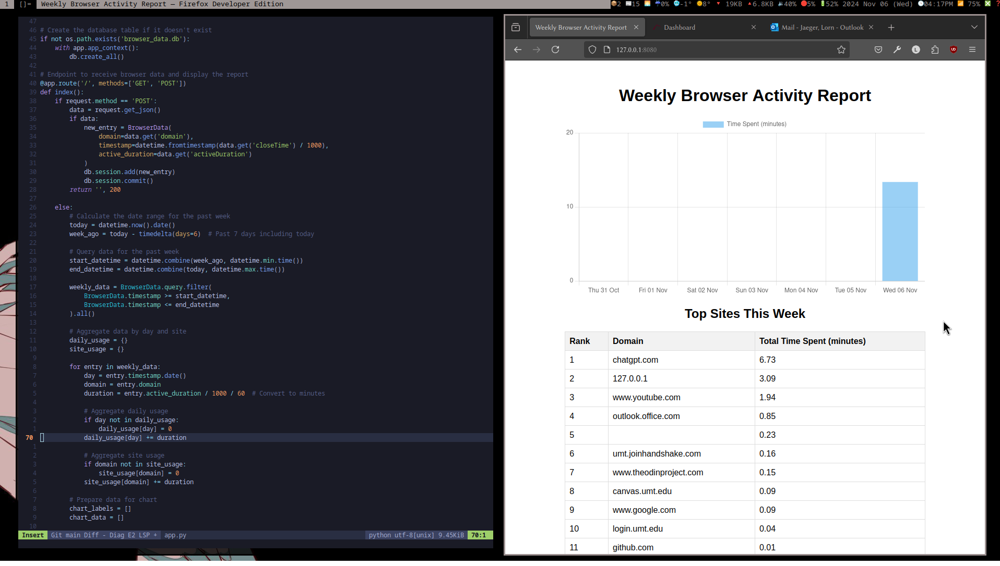

## self-analytics
A suite of trackers for my personal computer usage. Mostly extensions to software I use, sending analytics to a flask server running as a systemd service. Plans for things to track include lines/bytes written in vim, pomodoro sessions completed via my dwm plugin, git statistics with git hooks, and anki stats. 

Inspired in part by ulogme.

